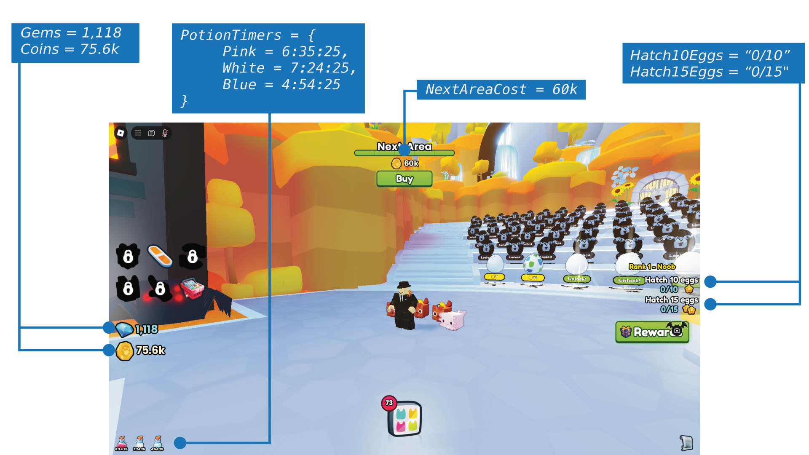

Imagine the state of your game as individual pieces of data.



<figcaption>Screenshot: Pet Simulator 99</figcaption>

When variables change, you want your game to reflect those changes.

Unfortunately, there's no way to listen for those changes in Luau.

You may try something like this:

```luau
local Hatch10Eggs = 0
local isQuestComplete = false

local function updateQuestUI()
	PlayerGui.Quests.FirstQuest.CountText.Text = Hatch10Eggs
end

local function updateQuestComplete()
	isQuestComplete = Hatch10Eggs >= 10
end

local function setEggCount(newEggCount)
	Hatch10Eggs = newEggCount
	-- you need to send out updates to every piece of code using `eggCount` here
	updateQuestUI()
	updateQuestComplete()
	updateEggCountToServer()
end
```

But often gets messy.

- How do we share these updates across scripts?
- What if there's another piece of code using `Hatch10Eggs` that we've forgotten to update here?

### Building Better Variables

What if we could just change value and it updates everywhere _automatically_, like magic.

That's exactly what Weave does.

```luau
local QuestData = {
	Hatch10Eggs = Value.new(0),
	Hatch15Eggs = Value.new(0),
}
```

```luau
-- Update a UI TextLabel
Attach(CountText) {
	Text = QuestData.Hatch10Eggs
}
```

```luau
-- Update a quest complete boolean
local isQuestComplete = Computed.new(function()
	return QuestData.Hatch10Eggs:get() >= 10
end)
```

Store state in a `Value` change the object's value using `:set()`.

Then, when it changes, it will update everything that references it.

Hence the Weave motto, _set it and forget it_
